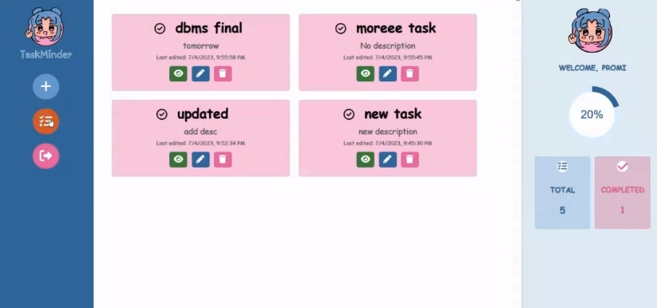
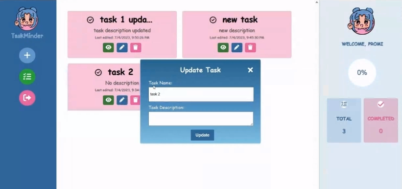
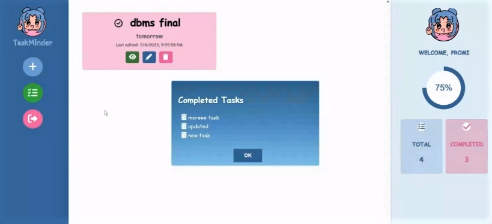

# To-Do-App
The application is a to-do list manager that utilizes Node.js for the backend server implementation, while the frontend is built using HTML, CSS, and JavaScript. 

* Database: MySQL or PostgreSQL
* Apply Design Pattern
* Use Postman Collector
* Run query manually (Don't use ORM Library)

**Functionality:**
- user login with email and password
- token validation
- set task, update task, delete task, mark complete task

### Project Screenshots

  **Sign up and Sign in form with toggle-button**
  
  
  
  
  **Profile Page with Task-lists**
  
  

  **Update pop-up form shows when update task button is clicked**
  
  

  **Completed task-lists**
  
  

 
